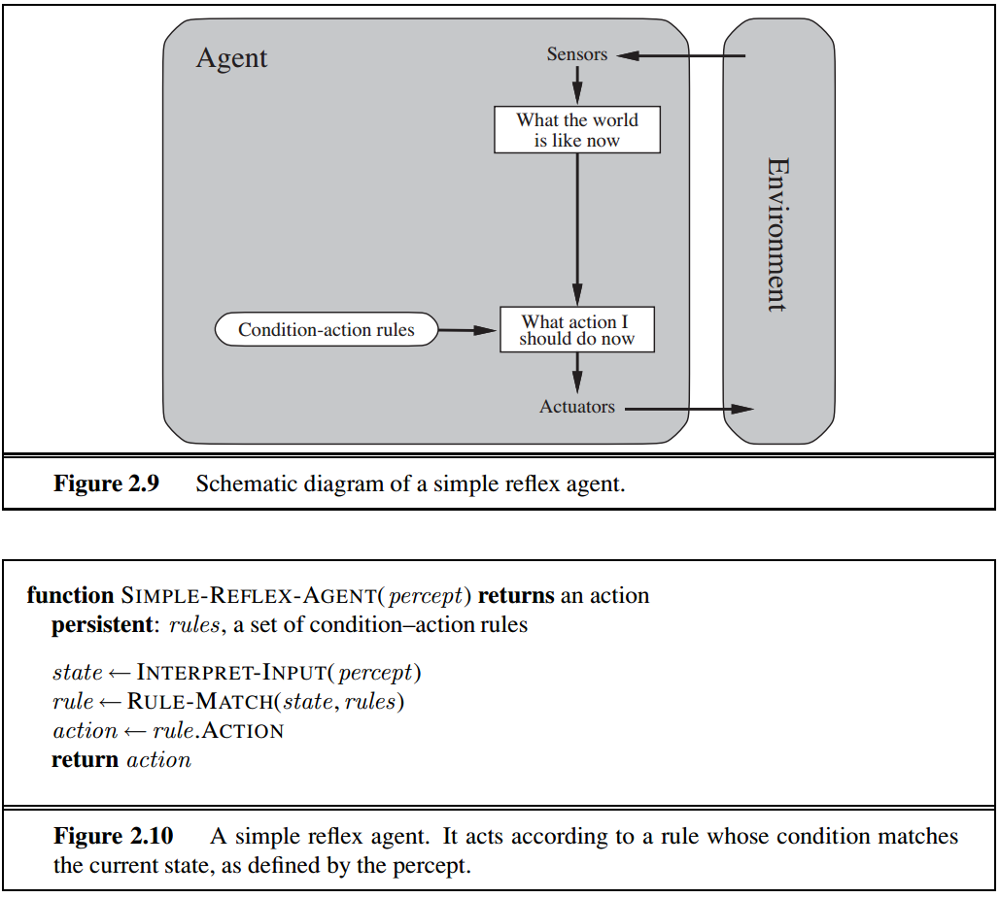
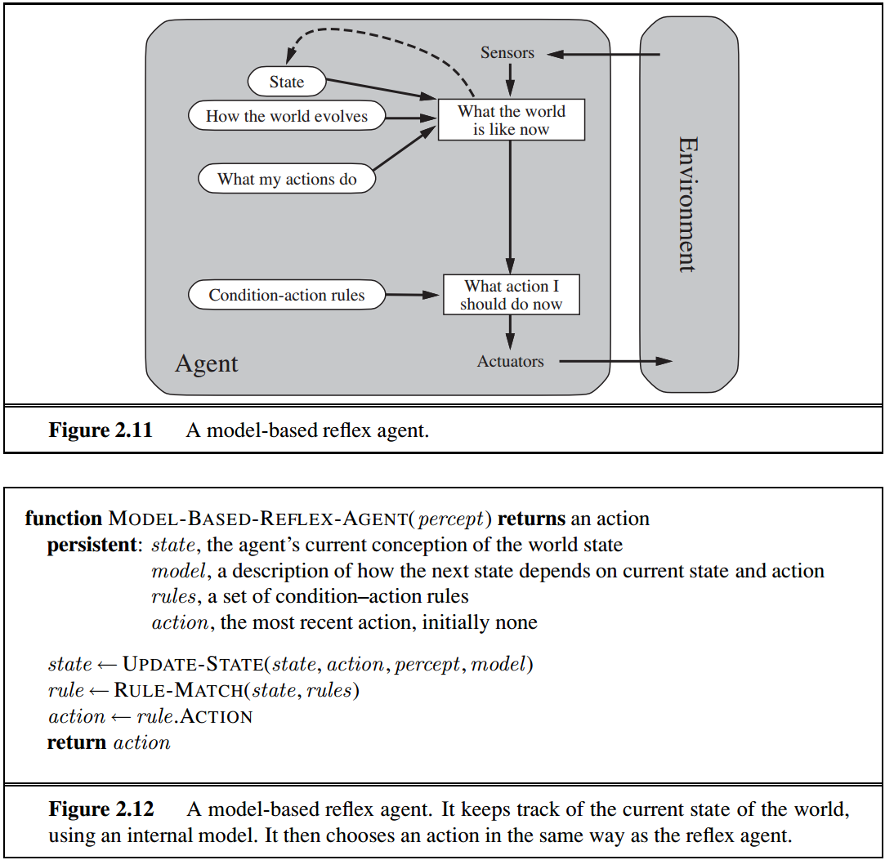
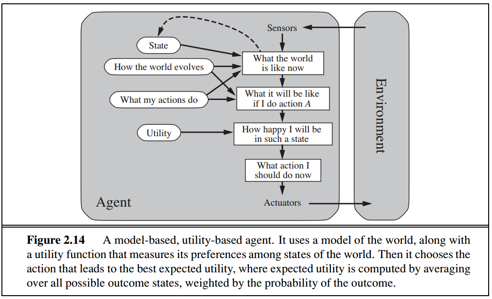
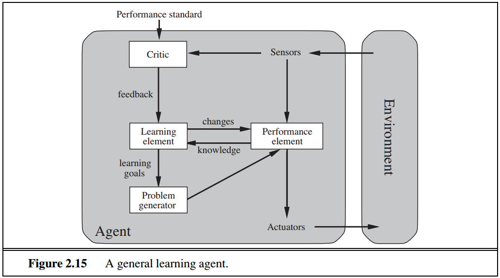
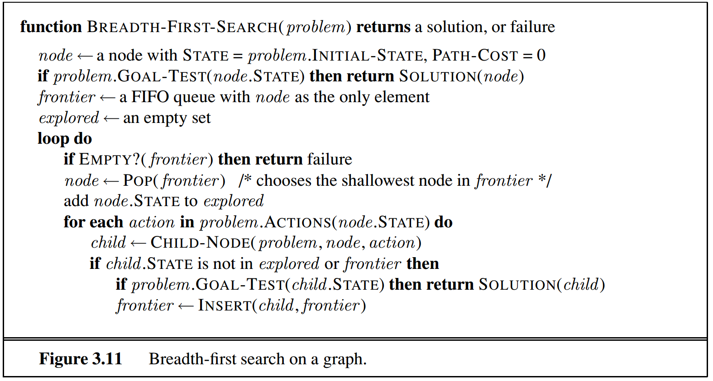
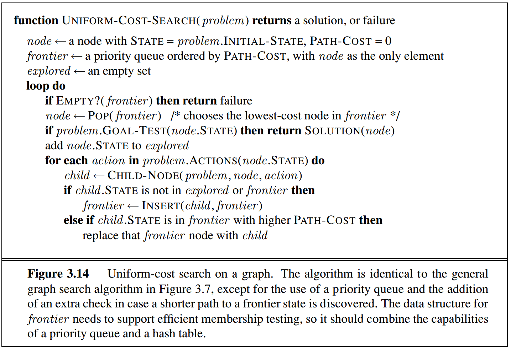
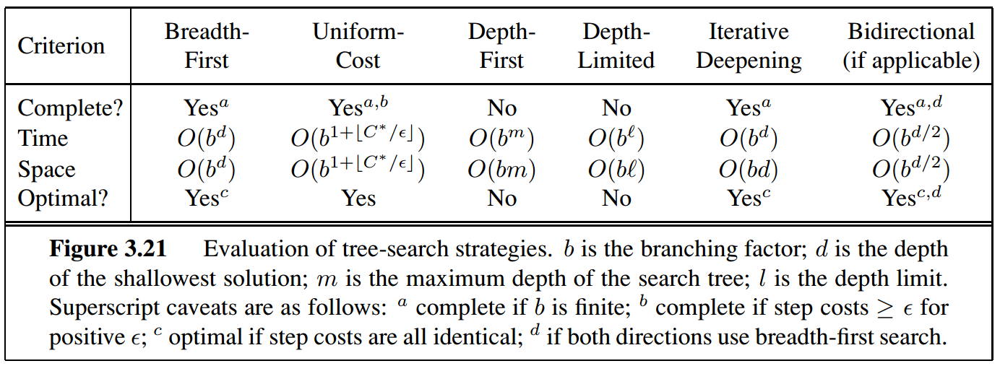
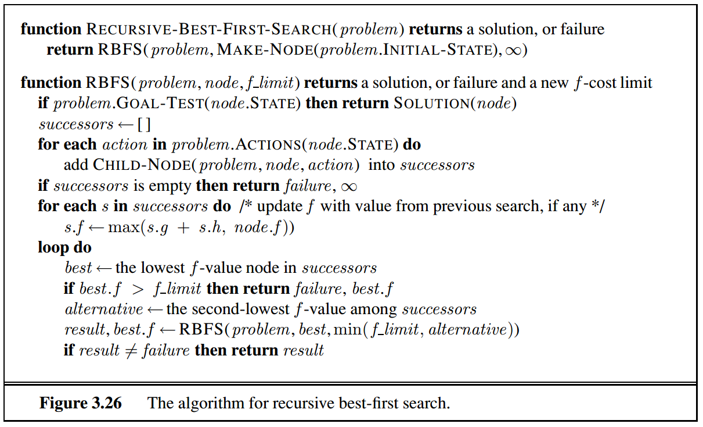

# Notes for *Artificial Intelligence: A Modern Approach*

## 1. Introduction

### Definition of AI

Four kinds definition of AI

|                  |                     |
|:-----------------|:--------------------|
| Thinking Humanly | Thinking Rationally |
| Acting Humanly   | Acting Rationally   |

1. Acting Humanly

    Turing Test, with following six disciplines

    * natural language processing

    * knowledge representation

    * automated reasoning

    * machine learning

    * computer vision

    * robotics

1. Thinking Humanly

    Cognitive modeling / cognitive science

    Three ways to get inside the actual working of human minds:

    * through introspection

    * through psychological experiments

    * through brain imaging

1. Thinking rationally

    Laws of thought / logic

    Two main obstacles to solve any solvable problem described in logical notation:

    * hard to state knowledge in formal terms

    * solving in practice is much harder than solving in principle

1. Acting rationally

    **Rational agent** is expected to:

    * operate autonomously

    * perceive their environment

    * persist over a prolonged time period

    * adapt to change

    * create and pursue goals

    Two advantages of rational agent:

    * More general than the "law of thought" approach / Thinking rationally

    * More amenable than approaches based on human thought or human behavior

    **This book concentrates on *rational agents*.**

### The Foundations of artificial Intelligence

1. Philosophy

    * Can formal rules be used to draw valid conclusions?

        Syllogisms, Calculating machine, Pascaline, Artificial animal

    * How does the mind arise from a physical brain?

        * rationalism

            Aristotle, Leibnitz

        * dualism

            Descartes

        * materialism

    * Where does knowledge come from?

        empiricism, logical positivism, confirmation theory, observation sentences, induction

    * How does knowledge lead to action?

        **Actions are justified by a logical connection between goals and knowledge of the action’s outcome. (By Aristotle)**

        Newell and Simon's GPS

        Antoine Arnauld's quantitative formula

        John Stuart Mill’s rational decision criteria

1. Mathematics

    AI become a formal science need mathematical formalization in:

    * logic - What are the formal rules to draw valid conclusions?

        propositional logic/Boolean logic

        first-order logic

    * computation - What can be computed?

        * algorithm

            Euclid's algorithm for computing greatest common divisors

            logical deduction

            incompleteness theorem,

        * tractability

            NP-completeness

    * probability - How do we reason with uncertain information?

        uncertain measurements

        incomplete theories

        Bayes’ rule

1. Economics

    * How should we make decisions so as to maximize payoff?

        preferred outcomes/utility

    * How should we do this when others may not go along?

        Decision theory

        Game theory        

    * How should we do this when the payoff may be far in the future?

        operations research

        Markov decision processes

        satisficing

1. Neuroscience

    * How do brains process information?

        Broca’s area, neurons, EEG, fMRI

        mysticism

1. Psychology

    * How do humans and animals think and act?

        * Behaviorism

        * Cognitive Psychology

            three key steps of a knowledge-based agent:

            1. the stimulus must be translated into an internal representation

            1. the representation is manipulated by cognitive processes to derive new internal representations

            1. these are in turn retranslated back into action

            | Paper | Author | Part of cognitive psychology |
            |-------|--------|------------------------------|
            | *The Magic Number Seven*   | George Miller               | memory           |
            | *Three Models of Language* | Noam Chomsky                | logical thinking |
            | *The Logic Theory Machine* | Allen Newell, Herbert Simon | language         |

1. Computer engineering

    * How can we build an efficient computer?

        automated machine

        programmable machine - a loom

        Analytical Engine

        electronic computer

        massive parallelism

1. Control theory and cybernetics

    * How can artifacts operate under their own control?

        water clock, steam engine governer, thermostat, submarine

        stable feedback system

        control theory

        homeostatic devices

        stochastic optimal control

1. Linguistics

     * How does language relate to thought?

     computational linguistics / natural language processing

     knowledge representation
·
### The History of artificial Intelligence

1. The gestation of artificial intelligence (1943–1955)

    *  Warren McCulloch and Walter Pitts's model of artificial neurons based on:
        * knowledge of the basic physiology and function of neurons in the brain

        * a formal analysis of propositional logic due to Russell and Whitehead

        * Turing’s theory of computation.

    * Hebbian learning

    * Marvin Minsky and Dean Edmonds's neural network

    * Alan Turing’s vision:

        * Turing Test

        * machine learning

        * genetic algorithms

        * reinforcement learning

        * the Child Programme idea

1. The birth of artificial intelligence (1956)

    * Dartmouth workshop (2 month, 10 man)

    * Logic Theorist (LT)

    * **Why it was necessary for AI to become a separate field.?**

        * The first answer is that AI from the start embraced the idea of duplicating human faculties such as creativity, self-improvement, and language use.

        * The second answer is methodology. AI is the only one of these fields that is clearly a branch of computer science (although operations research does share an emphasis on computer simulations), and AI is the only field to attempt to build machines that will function autonomously in complex, changing environments.

1. Early enthusiasm, great expectations (1952–1969)

    * General Problem Solver

    * Physical symbol system hypothesis

    * Geometry Theorem Prover

    * Advice Taker

    * Question-answering and planning systems

    * Shakey robotics project

    * SAINT program, ANALOGY program, STUDENT program

    * adalines, perceptrons, perceptron convergence theorem

1. A dose of reality (1966–1973)

    *  Machine translation

    * intractability

    * fundamental limitations

1. Knowledge-based systems: The key to power? (1969–1979)

    * DENDRAL program

    * Heuristic Programming Project (HPP)

    * expert system

    * Medical diagnosis / MYCIN

    * understanding natural language on knowledge

    * representation and reasoning languages

1. AI becomes an industry (1980–present)

    *  expert system, R1, Digital Equipment Corporation (DEC)

    * Fifth Generation (Japan)

    * Microelectronics and Computer Technology Corporation (MCC) (U.S.)

    * Intelligent Knowledge-Based Systems(IKBS, Britain)

1. The return of neural networks (1986–present)

    * back-propagation learning algorithm

    * connectionist model

    * modern neural networks, separated into two fields:

        * creating effective network architectures and algorithms and understanding their mathematical properties

        * the other concerned with careful modeling of the empirical properties of actual neurons and ensembles of neurons

1. AI adopts the scientific method (1987–present)

    **In terms of methodology, AI has finally come firmly under the scientific method.**

    * Speech recognition - hidden Markov models (HMMs)

    * Machine translation

    * Neural network -> data mining

    * Bayesian network formalism

    * normative expert systems

1. The emergence of intelligent agents (1995–present)

    * search engines

    * recommender systems

    * Web site aggregators

     * driving a car

     * playing chess

     * recognizing speech

     * human-level AI(HLAI)

     * Artificial General Intelligence(AGI)

 1. The availability of very large data sets (2001–present)

    **But some recent work in AI suggests that for many problems, it makes more sense to worry about the data and be less picky about what algorithm to apply.**

### The state of the art

* Robotic vehicles

* Speech recognition

* Autonomous planning and scheduling

    Remote Agent / MAPGEN / MEXAR2

* Game playing

    DEEP BLUE

* Spam fighting

* Logistics planning

    Dynamic Analysis and Replanning Tool, DART

* Robotics

    robotic vacuum cleaners, PackBot

* Machine Translation

### Summary

See notes above or the book.

### Bibliographical notes

The major AI conferences:

* the biennial International Joint Conference on AI (IJCAI)

* the annual European Conference on AI (ECAI)

* the National Conference on AI (AAAI)

The major journals for general AI:

* *Artificial Intelligence*

* *Computational Intelligence*

* *IEEE Transactions on Pattern Analysis and Machine Intelligence*

* *IEEE Intelligent Systems*

* *Journal of Artificial Intelligence Research* (electronic)

The main professional societies for AI:

* American Association for Artificial Intelligence (AAAI)

* ACM Special Interest Group in Artificial Intelligence (SIGART)

* Society for Artificial Intelligence and Simulation of Behaviour (AISB)

---

## 2. Intelligent Agents

### Agents and Environments

* agent

* environment

* sensors

* actuators

* agent function, agent program

### Good beahavior: the concept of rationality

* performance measurement

    1. This notion of desirability is captured by a performance measure that
    evaluates any given sequence of **environment states**.

    1. As a general rule, it is better to design performance measures according to what one actually wants in the environment, rather than according to how one thinks the agent should behave.

* rationality

    For each possible percept sequence, a **rational agent** should select an action that is expected to **maximize its performance measure**, given the evidence **provided by the percept sequence** and whatever **built-in knowledge** the agent has.

* Omniscience, learning, and autonomy

     Rationality maximizes expected performance, while perfection maximizes actual performance.

     **After sufficient experience of its environment, the behavior of a rational agent can become effectively independent of its prior knowledge.**

### The nature of environments

* Test environment = PEAS (Performance, Environment, Actuators, Sensors)

* Properties of task environments

    1. Fully observable vs. partially observable

    1. Single agent vs. multiagent

        The key distinction of whether B is a agent or not is whether B’s behavior is best described as maximizing a performance measure whose value depends on agent A’s behavior.

        * competitive multiagent environment

        * cooperative multiagent environment.

    1. Deterministic vs. stochastic

        An environment is uncertain if it is not fully observable or not deterministic.

    1. Episodic vs. sequential

    1. Static vs. dynamic

    1. Discrete vs. continuous

    1. Known vs. unknown

### The structure of agents

* *agent = architecture + program*

* agent program

    The difference between the **agent program**, which takes the current percept as input, and the **agent function**, which takes the entire percept history.

    Four basic kinds of agent programs:

    * **Simple reflex agents**

        Simple reflex agents select actions on the basis of the current percept, ignoring the rest of the percept history.

        

    * **Model-based reflex agents**

        

    * **Goal-based agents**

        

    * **Utility-based agents**

        

    * **Learning agents**

        

        A learning agent can be divided into four conceptual components:

        * problem generator
        * learning element
        * performance element
        * critic

* How the components of agent programs work

    The components of agent can represent the environment in three ways:

    * atomic

        * search and game-playing

        * Hidden Markov models

        * Markov decision processes

    * factored

        * constraint satisfaction

        * propositional logic

        * planning

        * Bayesian networks

        * machine learning

    * structured

        * relational databases

        * first-order logic

        * first-order probability models

        * knowledge-based learning

        * natural language understanding

---

## 3. Solving problems by searching

Problem-solving agent is a kind of goal-based agent, and uses atomic representations.

### Problem-solving agents

* Goal formulation

    Goal formulation, based on the current situation and the agent’s performance measure, is the first step in problem solving. A goal is  considered to be **a set of world states**.

* Problem formulation

    Problem formulation is the process of deciding what actions and states to consider, given a goal.

* the environment

    * observable

    * discrete

    * Known

    * deterministic

* search / solution / execution

* problems can be defined by five components:

    * initial states

        *In(Arad)*

    * possible actions

        *{ Go(Sibiu), Go(Timisoara), Go(Zerind)}*

    * transition modeling

        *RESULT( In(Arad), Go(Zerind)) = In(Zerind)*

        **successor**

    The initial state, actions, and transition model implicitly define the **state space** of the problem

    * goal test

        The goal of this example is *{In(Bucharest)}*.

    * path cost

        The **step cost** of taking action a in state *s* to reach state *``s'``* is denoted by *c(s, a, s')*.

        **optimal solution**

### Example problems

Toy examples:

* Vacuum world

* 8-puzzle

* 8-queens problem

    * incremental formulation

    * complete-state formulation

Real-world problems:

* route-finding problem

* touring problem

    * traveling salesperson problem (TSP)

* VLSI layout problem

    * cell layout

    * channel routing

* robot navigation

* automatic assembly sequencing

* protein design (another assembly problem)

### Searching for solutions

* searching tree

    * root -- initial state

    * branches -- actions

    * nodes -- states

    * expanding

    * generating

    * leaf nodes

    * frontier (or open list which is not accurate)

    * repeated state, loopy path

* TREE-SEARCH algorithm

* search strategy

* loopy path, redundant paths

* GRATH-SEARCH algorithm

    * explored set (or closed list)

    * Separation property

* infrastruture for search algorithms

    * four components of the structure of tree node

        * state

        * parent

        * action

        * path-cost

    * CHILD-NODE function

    * SOLUTION function

    * frontier structure

        The appropriate data structure for frontier is a **queue**.

        * EMPTY?(queue)

        * POP(queue)

        * INSERT(element,queue)

        * queue variants

            * FIFO queue / first in, first-out

            * LIFO queue / last-in, first-out / stack

            * priority queue

        * explored set

            The explored set can be implemented with a **hash table** to allow efficient checking for repeated states.

            * insert

            * lookup

* Measuring problem-solving performance

    * We can evaluate an algorithm’s performance in four ways:

        * Completeness

        * Optimality

        * Time complexity

        * Space complexity

    * complexity / problem difficulty

        * the theoretical computer science ways

            the size of the state space graph, |V|+|E|, where V is the set of vertices (nodes) of the graph and E is the set of edges (links).

        * the AI way

            * *b*, **branching factor**

            * *d*, **depth**

            * *m*, the maximum length of an path in the state space

        * Time is often measured in terms of the number of nodes generated during the search, and space in terms of the maximum number of nodes stored in memory.

    * search cost

    * total cost

### Uninformed search strategies

* Breadth-first search

   * Breadth-first search is a simple strategy in which the root node is expanded first, then all the successors of the root node are expanded next, then their successors, and so on.

   * use a FIFO queue for the frontier

   * **the goal test is applied to each node when it is generated** rather than when it is selected for expansion.

   * pseudo code

        

    * performance

        * is complete if the shallowest goal node is at some finite depth d.

        * is optimal if **the path cost is a nondecreasing function of the depth of the node.**

        * total number of nodes generated at depth *d* where every state has *b* successors is:

            $$b+b^2+b^3+...+b^d=O(b^d)$$

        * There will be $O(b^{d-1})$ nodes in the explored set and $O(b^d)$ nodes in the frontier, so the space complexity is $O(b^d)$.

* uniform-cost search

    * uniform-cost search expands the node *n* with the *lowest path cost g(n)*.

    * use a priority queue ordered by *g* for the frontier.

    * the goal test is applied to a node when it is selected for expansion

    * uniform-cost search expands nodes in order of their optimal path cost

    * pseudocode

        

    * performance

        * Completeness is guaranteed provided the cost of every step exceeds some small positive constant $\epsilon$

        * The worst-case time and space complexity is $O(b^{1+\lfloor C^* /\epsilon\rfloor})$

* depth-first search

    * use a LIFO queue as the frontier

    * performance

        * completeness

            * finite state space

                * using the graph-search is complete

                * using the tree-search version is not complete

            * In infinite state space, both are not complete if  an infinite non-goal path is encountered

        * is nonoptimal

        * The time complexity is $O(b^m)$, where $m$ is the maxium depth of any node. *infinite* if the tree is unbounded.

        * The space complexity is $O(bm)$

        * backtracking search

* depth-limited search

    * time complexity is $O(b^l)$, space complexity is $O(bl)$, where $l$ is the predetermined depth limit.

    * the **diameter** of the state space

* iterative deepening depth-first search

    * The space complexity is $O(bd)$

    * complete when the branching factor is finite

    * optimal when the path cost is a nondecreasing function of the depth of the node

    * The total number of nodes generated in the worst case is
    $$N(IDS) = (d)b + (d-1)b^2+...+ (1)b^d$$

    * **In general, iterative deepening is the preferred uninformed search method when the search space is large and the depth of the solution is not known.**

    * a hybrid approach

* bidirectional search

    * Both the time complexity and space complexity is $O(b^{d/2})$

    * This **space requirement** is the most significant **weakness** of bidirectional search.

* comparing uninformed search strategies

    

### Informed (heuristic) search strategies

* best-first search

    * expand node based on **evaluation function**, $f(n)$

    * heuristic function $h(n)$

* greedy best-first search

    * expand the node that is closest to the goal

    * use the heuristic function as evaluation function $f(n)=h(n)$

    * completeness

        * the tree version is **incomplete** even in a finite state space

        * the graph version is complete in finite spaces, but incomplete in infinite spaces

    * time and space complexity is $O(b^m)$, where $m$ is the maximum depth of the search space. The complexity can be reduced with a good heuristic function.

* A* search

    * the evaluation function $$f(n)=g(n)+h(n)$$

        * $g(n)$, the cost to reach the node

        * $h(n)$, the cost to get from the node to the goal

    * conditions for optimality

        provided that the heuristic function $h(n)$ satisfies certain conditions, A∗ search is both complete and optimal.

        * admissibility

            * An **admissible heuristic** is one that **never overestimates** the cost to reach the goal.

            * Admissible heuristics are by nature optimistic because they think the cost of solving the problem is less than it actually is.

                * **WHY?** if f(n) is overestimates the cost, then if f(n)>f(m) and we choose m, but the ActualCost(n) can be less than f(n), and so may be less than ActualCost(n), that makes the search not optimal and irrational. So,we need to be never overestimate. But how to guarantee the optimality.**Prove admissible is optimal!!!**

        * consistency (monotonicity)

            A heuristic $h(n)$ is consistent if $$h(n)\leq c(n,a,n')+h(n')$$ for every node $n$ and every successor $n'$ of $n$ generated by any action $a$.

    * optimality of A*

        * if $h(n)$ is consistent, then the values of $f(n)$ along any path are nondecreasing.

        * whenever A∗ selects a node $n$ for expansion, the optimal path to that node has been found.

        * properties of A*

            * A* expands all nodes with $f(n)<C^* $.

            * A* might then expand some of the nodes right on the "goal contour"  (where $f(n)=C^* $ ) before selecting a goal node.

        * A* is complete if all step costs exceed some finite $\epsilon$ and if $b$ is finite.

        * A∗ is **optimally efficient**.

        * complexity
            * absolute error

                $\Delta \equiv h^* - h$

                where $h^* $ is the actual cost of getting from the root to the goal.

            * relative error

                $\epsilon \equiv (h^* - h)/h^* $

            * complexity

                * The complexity results depend very strongly on the assumptions made about the state space.

                * simplest model

                    * a single goal

                    * a tree with reversible actions

                    * $O(b^\Delta)$

                    * for constant step costs $O(b^{\epsilon d})$

                * many goal states

                    * near-optimal goal states

                * practical way

                    * find suboptimal solution

                    * heuristics that are more accurate but not strictly admissible.

* Memory-bounded heuristic search

    *  iterative-deepening A∗ (IDA∗)

    *  Recursive best-first search (RBFS)

        

        * excessive node regeneration

        * RBFS is an **optimal** algorithm if the heuristic function h(n) is admissible

        * Its space complexity is **linear** in the depth of the **deepest optimal solution**.

        *  time complexity depends both on the accuracy of the heuristic function and on how often the best path changes as nodes are expanded.

    * memory-bounded A∗ (MA∗) / simplified MA∗ (SMA∗)

        * SMA∗ backs up the value of the forgotten node to its parent.

        * **memory limitations can make a problem intractable from the point of view of computation time**

* Learning to search better

    * metalevel state space

    * object-level state space

    * **metalevel learning**

### Heuristic funcions

* The heuristic function of 8-puzzle/15-puzzle

    * h1 = the number of misplaced tiles.

    * h2 = the sum of the distances of the tiles from their goal positions.

        * city block distance or **Manhattan distance**

* The effect of heuristic accuracy on performance

    * **effective branching factor** $ b^* $

    * $N + 1 = 1 + b^* + (b^*)^2 + \cdots + (b^*)^d$

        where

        * $N$ is the nodes generated by A∗

        * $d$ is the solution depth

    * it is generally better to use a heuristic function with higher values

* Generating admissible heuristics from relaxed problems

    * A problem with fewer restrictions on the actions is called a **relaxed problem**.

    * supergraph

    *  the cost of an optimal solution to a relaxed problem is an admissible heuristic for the original problem

    * The corresponding relax problem should be solved with out search.

    * ABSOLVER

    * composite heuristic

        $$h(n) = max\{h_1(n),h_2(n), \cdots , h_m(n)\}$$

* Generating admissible heuristics from subproblems: Pattern databases

    * pattern databases

    * disjoint pattern databases

* Learning heuristics from experience

    * inductive learning methods

    * the **features** of state

    * linear combination of features

        $$ h(n)=c_1 x_1(n)+c_2 x_2(n) $$
